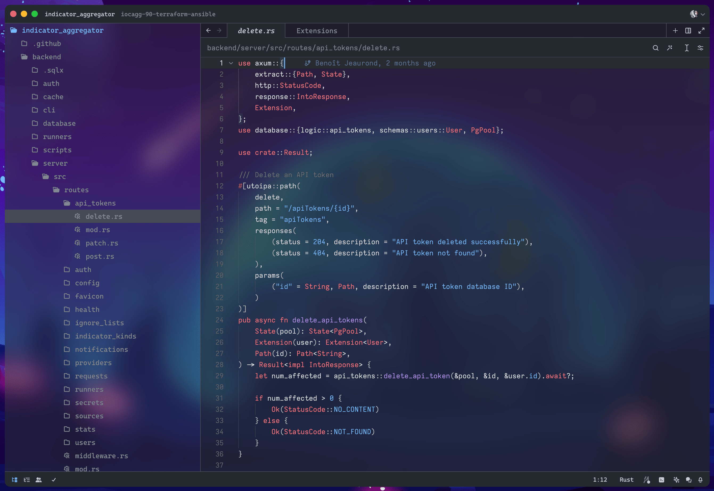

# Blurred Github's Zed themes

Project forked from [github-zed-theme](https://github.com/PyaeSoneAungRgn/github-zed-theme) and added blurred background.

## Screenshots

## Installation

Currently, the theme is not available in the marketplace. You can install it manually by following these steps:

### Install from GitHub

1. Clone this repository
2. Open `Command Palette`
3. Select `zed: extensions`
4. Select `Install Dev Extension`
5. Open the directory of the theme

## Activate Theme

1. Open `Command Palette`
2. Select `theme selector: toggle`
3. Search `Blurred GitHub Light` or `Blurred GitHub Dark`

## Contributing

Feel free to fork, make changes, and submit a pull request.
